# SeaTrader (tradebot)

Paper-first, swing/long-term **long-only** automated trading bot for **US equities + crypto** using **Alpaca US**.

This repo is designed to be:
- **Safe by default** (paper trading + dry-run guards)
- **Unattended-capable** (CLI commands suitable for cron/schedulers)
- **Explainable** (dashboards, artifacts, trade logs, backtest detail)
- **Extensible** (pluggable strategies + GUI Strategy Builder)

> Disclaimer: This project is for educational/personal use. Trading involves risk. Nothing here is financial advice.

---

## Screenshots

### Dashboard

**Classic (comfortable)**

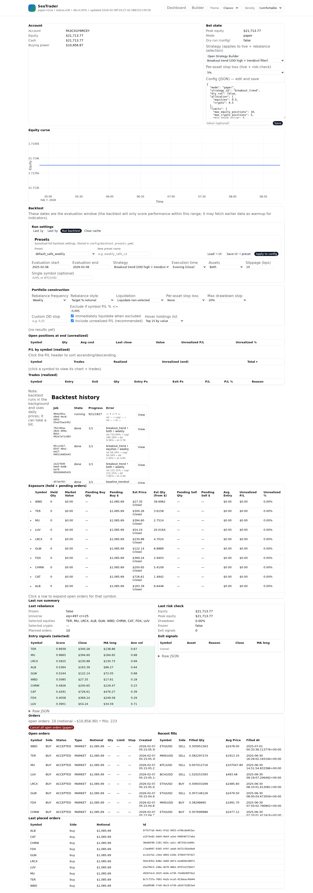

<details>
<summary>Fun / Dark (comfortable)</summary>

**Fun**

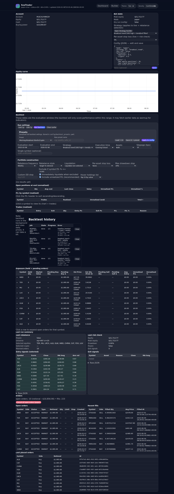

**Dark**

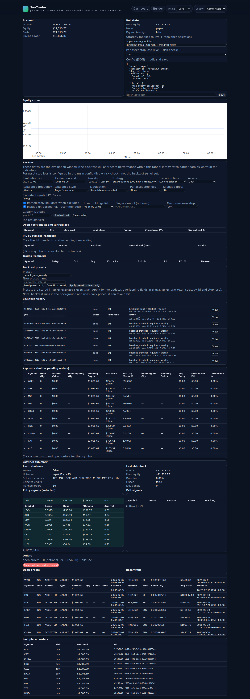

</details>

<details>
<summary>Compact density</summary>

**Classic (compact)**

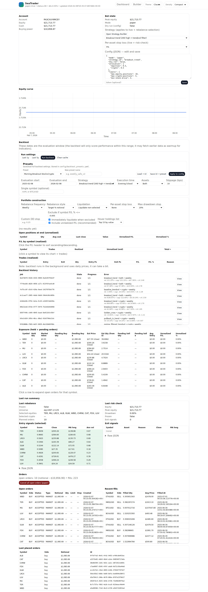

**Fun (compact)**

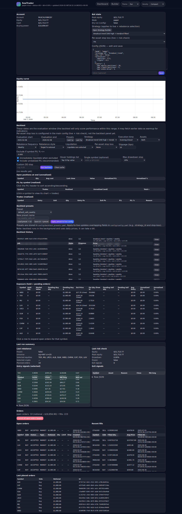

**Dark (compact)**

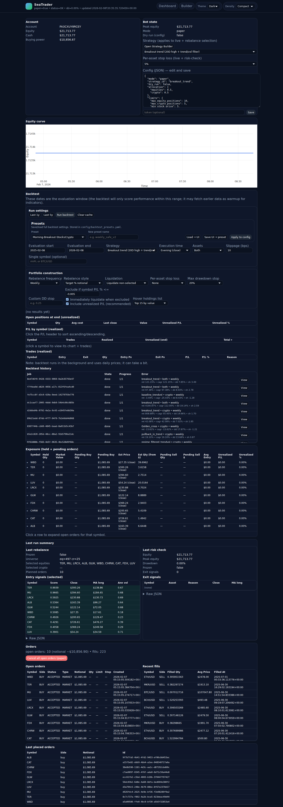

</details>

### Strategy Builder

**Classic (comfortable)**

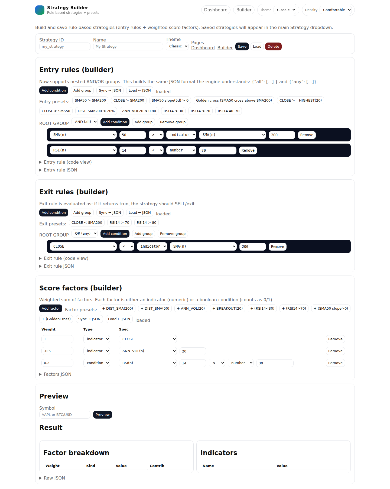

<details>
<summary>Fun / Dark (comfortable)</summary>

**Fun**

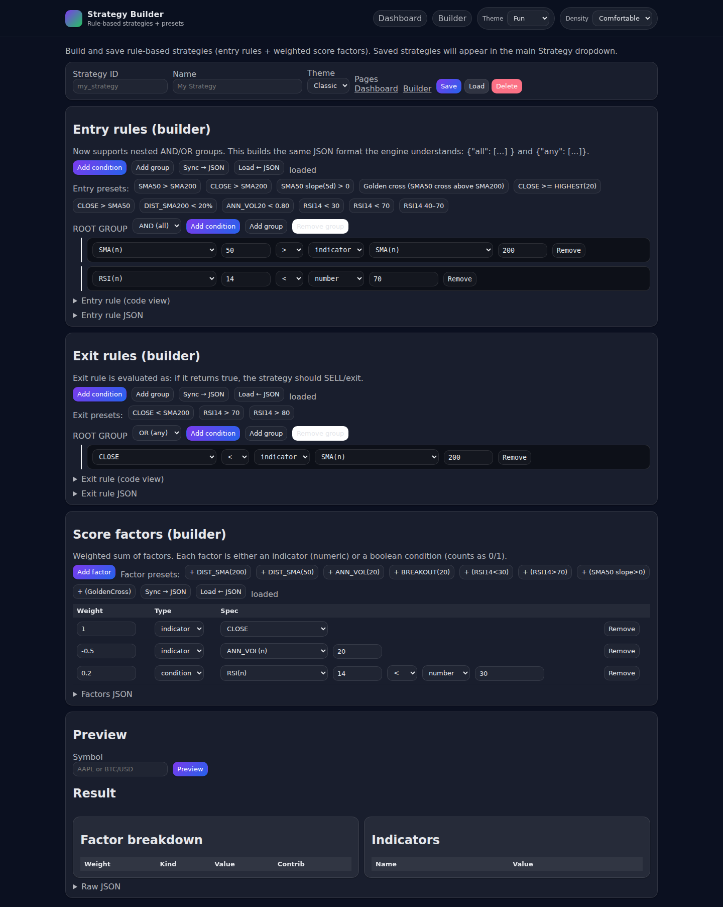

**Dark**

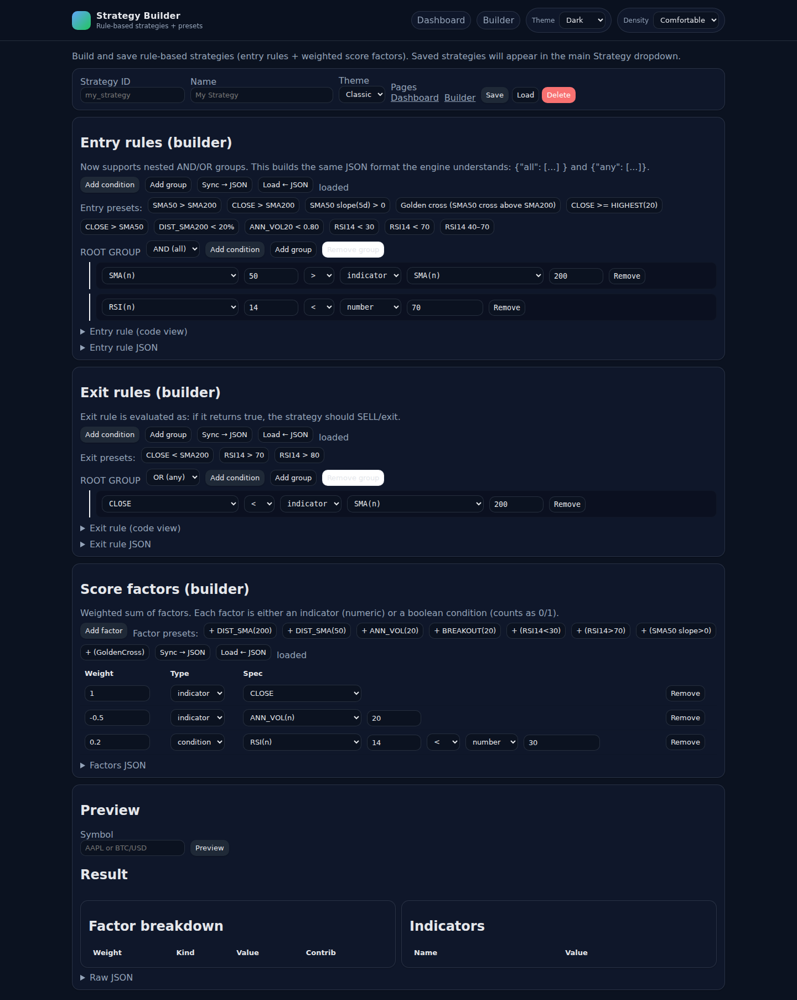

</details>

<details>
<summary>Compact density (builder)</summary>

**Classic (compact)**

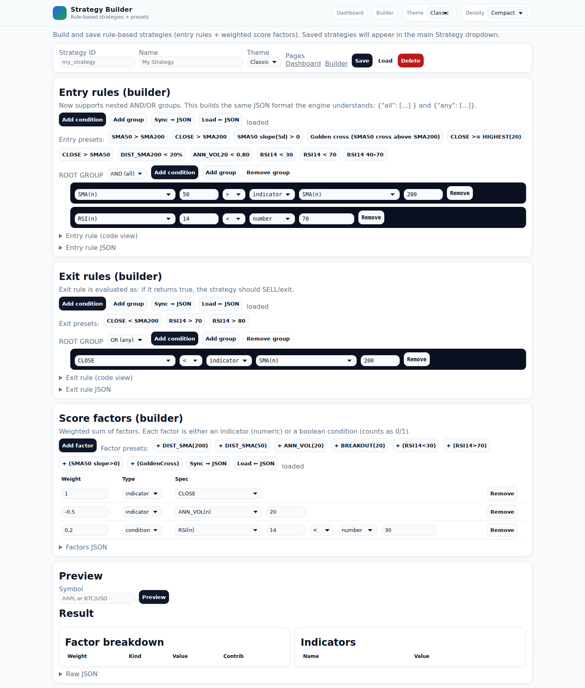

**Fun (compact)**

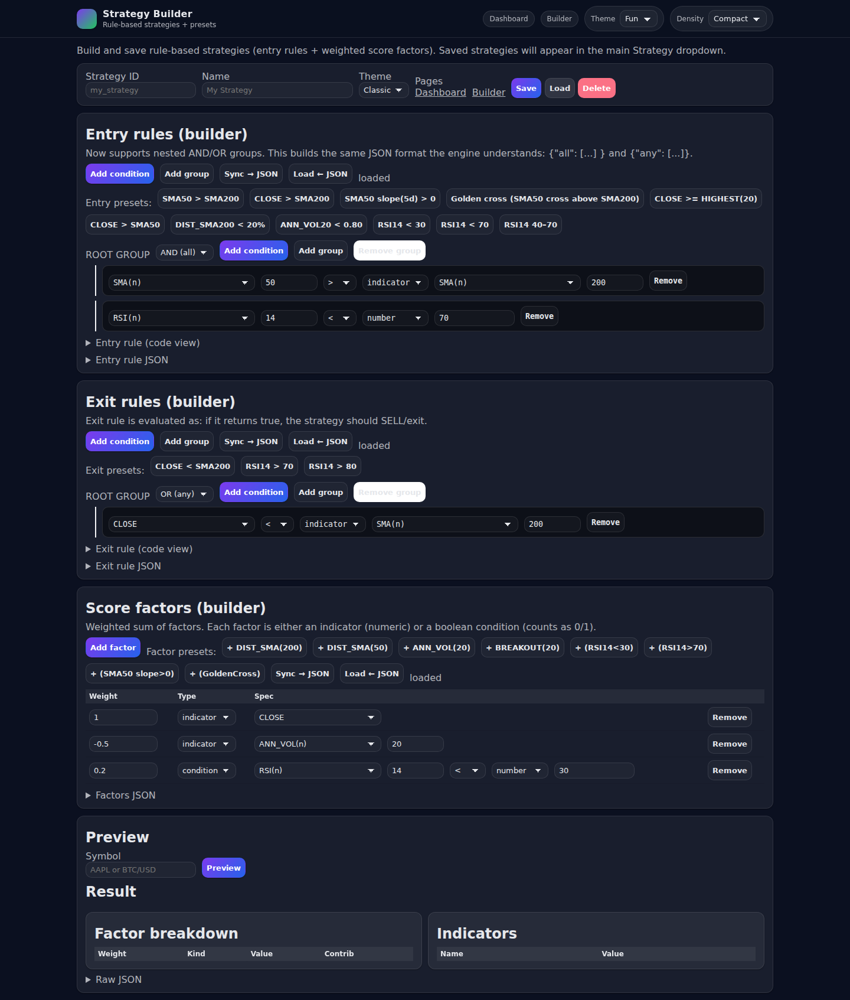

**Dark (compact)**

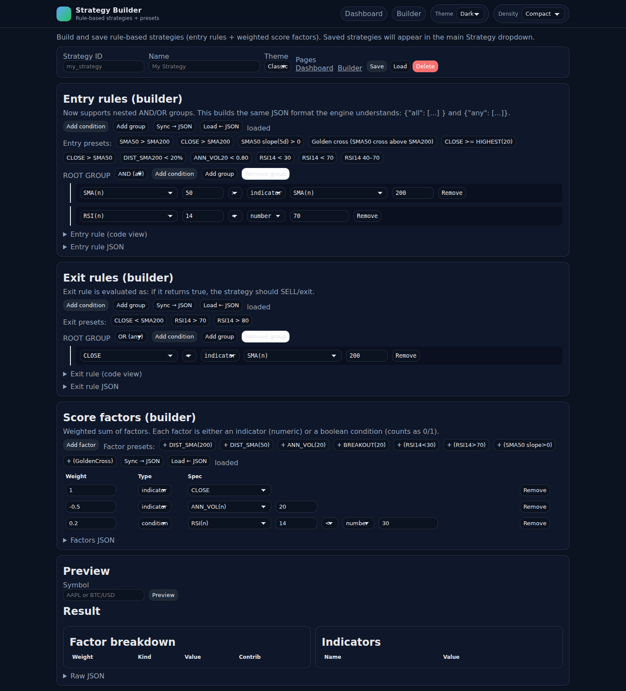

</details>

---

## Where we started → where we are

### Initial goal
Build a safe, unattended swing/long-term trading bot that:
- trades **both equities and crypto**
- paper trades first, then can be switched to live via config
- includes a local **HTML dashboard** for monitoring + config
- includes **backtesting** (including parameter sweeps)
- supports **pluggable strategies**, including a **GUI Strategy Builder** to define rules and weighted scoring

### Current state (high level)
✅ Working end-to-end pipeline:
- Universe → bars → signals → target weights → **order plan** → optional **paper order placement**
- Daily risk-check with drawdown tracking and exit signals
- Dashboard with monitoring + backtesting UI + Strategy Builder
- Strategy registry supports built-ins + user-defined strategies
- Unified preset system (`config/presets.yaml`) for backtest + live/paper parity
- Backtest engine supports stocks/crypto, slippage + limit-order simulation, intraday execution, order lifecycle events, and many toggles

---

## Key constraints / design decisions
- **Swing/long-term** focus (default: weekly rebalance + daily risk-check)
- **Long-only** (no shorts)
- **No margin**
- **No leveraged/inverse ETFs**
- **No penny stocks** (default min price: $5)
- Target allocation: **50% equities / 50% crypto** (cash allowed when nothing qualifies)
- Max positions: **10 stocks** and **5 crypto**
- Portfolio drawdown limit: **20%**
  - Live behavior chosen: **A = freeze** (no new entries; exits allowed)

---

## Safety defaults and guardrails

### Dry-run / order placement gating
- Default is **DRY_RUN** behavior: compute plans and print what would be done.
- Orders are only sent when you explicitly add `--place-orders`.

### Order guardrails (execution limits)
Configurable hard limits to prevent surprises:
- `execution.max_orders_per_run`
- `execution.max_single_order_notional_usd`
- `execution.max_total_notional_usd`

### Drawdown freeze
- Drawdown peak tracking stored locally in `data/state.json`
- When drawdown exceeds configured limit, bot can enter **FROZEN** mode
  - freezes new entries
  - allows exits/reductions

---

## Project layout

- `src/tradebot/` – core package
  - `cli.py` – main CLI entrypoint
  - `commands/` – CLI commands (`rebalance`, `risk-check`, `dashboard`)
  - `adapters/` – Alpaca clients + bar fetching
  - `strategies/` – built-in and user strategies
  - `backtest/` – backtest engine + job runner + cache
  - `dashboard/` – FastAPI app + HTML UI (dashboard + builder)
  - `risk/` – drawdown + exit signal helpers
  - `util/` – state, artifacts, equity curve utilities

- `config/config.yaml` – main configuration
- `data/` – local runtime output (artifacts, caches, backtests)

---

## Setup

### 1) Create a venv and install

```bash
cd tradebot
python3 -m venv .venv
source .venv/bin/activate
pip install -U pip
pip install -e .
```

### 2) Configure environment

Create a local `.env` (never commit secrets):

- Alpaca paper keys
- dashboard token settings

A `.env.example` exists as a template.

> Important: `.env` is gitignored. Do not commit credentials.

### 3) Verify Alpaca connectivity

Run dashboard or a dry-run command (below). If you hit an Alpaca market data error about SIP subscription, see **Data feed**.

---

## Data feed note (Alpaca)

For equities, this repo uses the **IEX feed** for Alpaca data access to avoid the common error:
> `subscription does not permit querying recent SIP data`

Crypto bars are fetched via Alpaca crypto data.

---

## Presets (unified backtest + paper/live)

Presets live in:
- `config/presets.yaml`

A preset contains:
- `backtest`: parameters for the backtest engine
- `bot`: a patch that is merged into `config/config.yaml` when `active_preset` is set

To activate a preset for paper/live runs, set:
- `active_preset: <name>` in `config/config.yaml`

Or override for a single run:
```bash
tradebot rebalance --preset default_safe_weekly
```

---

## Running the bot (CLI)

### Rebalance (plan only)
Computes a rebalance plan and prints it; does not place orders.

Live/paper rebalance behavior now supports parity knobs with backtests (via unified presets/config):
- `execution.use_limit_orders` + `execution.limit_offset_bps`
- `scheduling.weekly_rebalance_day`
- `rebalance.rebalance_mode` (`target_notional` / `no_add_to_losers`)
- `rebalance.liquidation_mode` (`liquidate_non_selected` / `hold_until_exit`)
- `rebalance.symbol_pnl_floor_pct` (+ include_unrealized + immediate liquidation toggle)
- `risk.portfolio_dd_stop` + `risk.dd_stop_behavior` (`freeze` / `liquidate_to_cash`)

```bash
tradebot rebalance --config config/config.yaml
```

### Rebalance (place paper orders)
Places orders only if:
- `DRY_RUN=false` and
- you pass `--place-orders`

Guardrails are configurable in `execution` and now support `null` (unlimited):
- `max_orders_per_run`
- `max_single_order_notional_usd`
- `max_total_notional_usd`

```bash
tradebot rebalance --config config/config.yaml --place-orders
```

### Rebalance (unattended at a specific time)
For unattended runs aligned to market open/close, you can optionally sleep until a local time before executing:

```bash
# Uses config.scheduling.timezone (default: America/Los_Angeles)
tradebot rebalance --config config/config.yaml --place-orders --wait-until 06:35
```

### Daily risk check
Runs drawdown checks, generates exit signals, and writes artifacts.

```bash
tradebot risk-check --config config/config.yaml
```

---

## Dashboard

Start the local dashboard:

```bash
./scripts/start_dashboard.sh
```

Default URL:
- http://127.0.0.1:8008

Dashboard highlights:
- Account section grouped into meaningful blocks (identity, cash/equity, risk/restrictions, buying power/margin)
- Open orders, recent fills, exposure view (pending notional/qty)
- Run artifacts (last rebalance / last risk-check / last placed orders)
- Backtesting UI with presets, execution modes, limit/fallback modeling, daily ledger, and drilldowns
- Search filters for realized trades and daily ledger symbols
- Action buttons: **Run paper rebalance**, **Run at configured time**, and **Run risk-check**
- Scheduler controls: **Setup cron / Restart cron / Stop cron** + cron detection/status
- Bot-state flags for queued rebalance and queued daily risk-check, with schedule visibility

### Dashboard auth token
Token gating can be enabled/disabled via env/config:
- `DASHBOARD_REQUIRE_TOKEN=false` (default in this project)

If you enable it, endpoints that mutate state (start backtest, save config, etc.) will require a token.

---

## Strategies

### Built-in strategies
Currently included (names may evolve):
- `baseline_trendvol`
- `regime_filtered_trendvol` (SPY/BTC trend gating)
- `breakout_trend`
- `pullback_in_trend`

### User strategies (Strategy Builder)
The Strategy Builder lets you create rule-based strategies with:
- **Entry rules**: nested AND/OR groups
- **Exit rules**: nested AND/OR groups
- **Score factors**: weighted sum of numeric indicators and boolean conditions

User strategies are stored as JSON under:
- `tradebot/strategies/user/<id>.json`

They appear automatically in the strategy dropdown.

### Rule engine indicators
Supported indicator kinds in rule-based strategies include:
- `CLOSE`
- `SMA(n)`
- `EMA(n)`
- `RSI(n)`
- `HIGHEST(n)`
- `LOWEST(n)`
- `ROC(n)`
- `RET_1D`
- `ANN_VOL(n)`

Derived/preset indicators:
- `DIST_SMA(n)`
- `BREAKOUT(n)`
- `CROSS_ABOVE(fast, slow)` (exposed via presets)
- `SMA_SLOPE(n, lookback)` (exposed via presets)

---

## Backtesting

Backtests run in the background via the dashboard or programmatically.

### Features
- Stocks + crypto support
- Slippage model (bps)
- Weekly or daily rebalance (+ weekly rebalance day selector)
- Limit order simulation (with optional fallback to market-at-open)
- Pending limit lifecycle simulation:
  - place limit
  - fill when touched (minute bars when intraday data available)
  - optional fallback market fill
  - cancel unfilled at next rebalance boundary
- Order lifecycle summary in results (placed / filled / fallback / canceled)
- Liquidation modes:
  - liquidate non-selected
  - hold until exit
- Per-asset stop loss (daily check)
- Portfolio drawdown stop
- Strategy selection in the backtest UI
- Interactive charts + symbol drilldowns + event markers
- Optional exclusion rule: stop trading a symbol if its P/L falls below a floor
  - optionally includes unrealized P/L
  - optionally liquidates immediately when excluded

### Backtest artifacts
Each backtest job writes:
- `data/backtests/<job_id>/status.json`
- `data/backtests/<job_id>/result.json`

Backtest history in the UI shows key metrics for quick scanning.

### Caching
Bars are cached to parquet under:
- `data/cache/bars/`

Cache keys include the date range to avoid stale-range bugs.

---

## Artifacts (runtime outputs)

The bot writes these “last run” artifacts into `data/`:
- `last_account.json`
- `last_rebalance.json`
- `last_risk_check.json`
- `last_placed_orders.json`

And maintains:
- `state.json` (drawdown peak and freeze tracking)
- `equity_curve.jsonl` (for dashboard charting)

---

## Troubleshooting

### Alpaca SIP subscription error
If you see:
- `subscription does not permit querying recent SIP data`

Use IEX feed for equities (this repo already defaults to IEX in the adapter).

### Backtest doesn’t reflect selected strategy
Make sure dashboard is restarted after code changes and that backtest UI strategy selection is set (the backtest strategy dropdown is intentionally not overwritten by auto-refresh).

---

## Roadmap / future improvements

High-impact next steps:

### Strategy Builder
- Expand indicator library further (including multi-input indicators like ATR requires OHLC data)
- Better score-factor editing (more presets, validation, templates)
- “Explain why entry/exit passed/failed” (per-condition evaluation output)

### Backtesting
- Intraday execution time for **rebalance trades** (minute bars) ✅
- Expand intraday execution to stop-loss exits + exclusion liquidations
- Extend benchmark options and robust comparisons
- Performance refactor: precompute rolling indicators per symbol to speed large sweeps
- Better walk-forward testing / cross-validation

### Live execution enhancements
- Broker-native stop orders (requires order management/cancel-replace)
- Improved order types and sizing policies
- Scheduling hooks (cron templates, “run every weekday at X”, etc.)

### Data
- Improve/validate long-history cache coverage for meaningful 5y+ results

---

## Quick commands (copy/paste)

```bash
# start dashboard
./scripts/start_dashboard.sh

# plan rebalance (no orders)
tradebot rebalance --config config/config.yaml

# place paper orders (requires DRY_RUN=false and --place-orders)
tradebot rebalance --config config/config.yaml --place-orders

# daily risk check
tradebot risk-check --config config/config.yaml
```

---

## Changelog

### 2026-02-09
- Added unified preset behavior improvements (config values override preset defaults)
- Added dashboard execution controls for limit/market behavior, extended-hours, fallback options, and guardrail `none=unlimited`
- Added dashboard action controls (run rebalance/risk-check now, run at configured time)
- Added cron scheduler controls in dashboard (setup/restart/stop) with detection/status flags
- Added bot-state scheduling indicators for rebalance + daily risk-check
- Added richer account card (BOD/current equity & cash, deltas, grouped sections)
- Added recent fills comparison: expected price vs filled price + slippage bps (limit + market)
- Added backtest enhancements:
  - weekly rebalance day option
  - limit orders + fallback options
  - pending limit lifecycle simulation with cancel at next rebalance
  - order lifecycle summary
  - search filters for realized trades and daily ledger

### 2026-02-08
- Added themes/density polish, improved dashboard layout, and screenshot automation
- Added backtest presets and apply-to-config flow
- Added symbol drilldown improvements and detailed event markers
- Added daily ledger section and expanded backtest transparency
