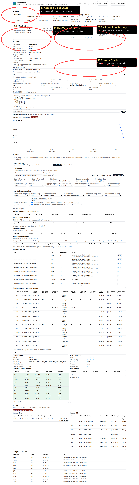
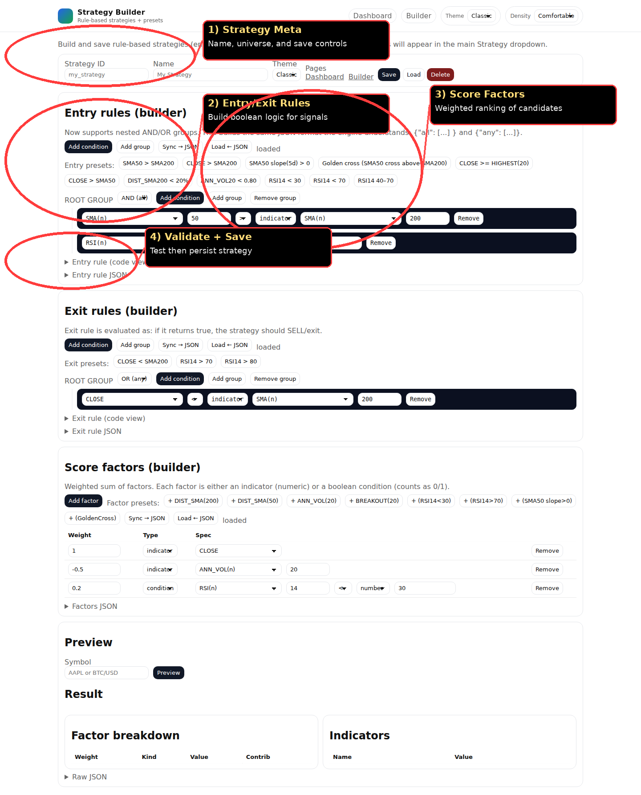

# SeaTrader Instructions (Operator Guide)

This guide is for day-to-day usage of SeaTrader in **paper mode first**, then live when validated.

---

## 1) Dashboard map (annotated)

### Main dashboard



What each callout means:

1. **Account & Bot State**  
   Watch equity/cash, flags, and quick-run actions.
2. **Live/Paper Controls**  
   Configure stop loss, execution behavior, schedules, and risk-check liquidation behavior.
3. **Backtest Run Settings**  
   Configure strategy + windows + per-asset execution/schedules and run tests.
4. **Results Panels**  
   Validate outputs: trades, daily ledger, open positions at end, backtest history.

### Strategy builder



What each callout means:

1. **Strategy Meta** — strategy id/name and save controls.
2. **Entry/Exit Rules** — boolean logic for position entry/exit.
3. **Score Factors** — weighted ranking when multiple candidates qualify.
4. **Validate + Save** — check and persist strategy JSON.

---

## 2) Safe operating flow

1. Start in **paper**.
2. Run backtests and confirm metrics + daily ledger behavior.
3. Run paper rebalance/risk-check from dashboard.
4. Verify expected behavior in artifacts (`last_rebalance.json`, `last_risk_check.json`).
5. Only then switch to live.

---

## 3) Critical settings (live/paper)

In **Live/Paper Controls**:

- **Per-asset stop loss**: used by risk-check.
- **Execute risk-check liquidations**:
  - `Off` = signals only.
  - `On` = places market sell orders on exit signals.
- **Stocks controls** / **Crypto controls**:
  - order type
  - limit offset
  - limit fallback
  - market buy time
- **Per-asset schedules**:
  - rebalance frequency/day/time
  - risk-check frequency/day/time

> Note: legacy global fallback controls were removed from dashboard; use per-asset controls only.

---

## 4) Backtest usage checklist

In **Backtest > Run settings**:

1. Choose strategy.
2. Choose window (1y/5y/custom).
3. Set per-asset order/schedule settings.
4. Run backtest.
5. Review:
   - return, drawdown, trade count
   - open positions at end
   - P/L by symbol
   - daily ledger consistency
6. Save iteration report when sweeping times.

---

## 5) Heartbeat behavior (SeaTrader-only)

Current heartbeat watches:

- Backtest status transitions (`done` / `failed`)
- Risk-check liquidation/exit events

State file:

- `memory/heartbeat-state.json`

If no new event, heartbeat returns `HEARTBEAT_OK`.

---

## 6) Quick commands

```bash
# start dashboard
./scripts/start_dashboard.sh

# rebalance (no orders)
tradebot rebalance --config config/config.yaml

# rebalance with order placement (paper/live based on config)
tradebot rebalance --config config/config.yaml --place-orders

# run risk-check
tradebot risk-check --config config/config.yaml
```

---

## 7) Troubleshooting

### Risk-check not liquidating
- Ensure `risk.execute_exit_liquidations: true`
- Ensure `dry_run: false`
- Check `data/last_risk_check.json` for `executed_liquidations`

### Heartbeat says OK but no message
- `HEARTBEAT_OK` is normal when no new event is detected.

### Backtest numbers look unrealistic
- Increase realism constraints (min crypto price, liquidity filters, etc.) and rerun.
