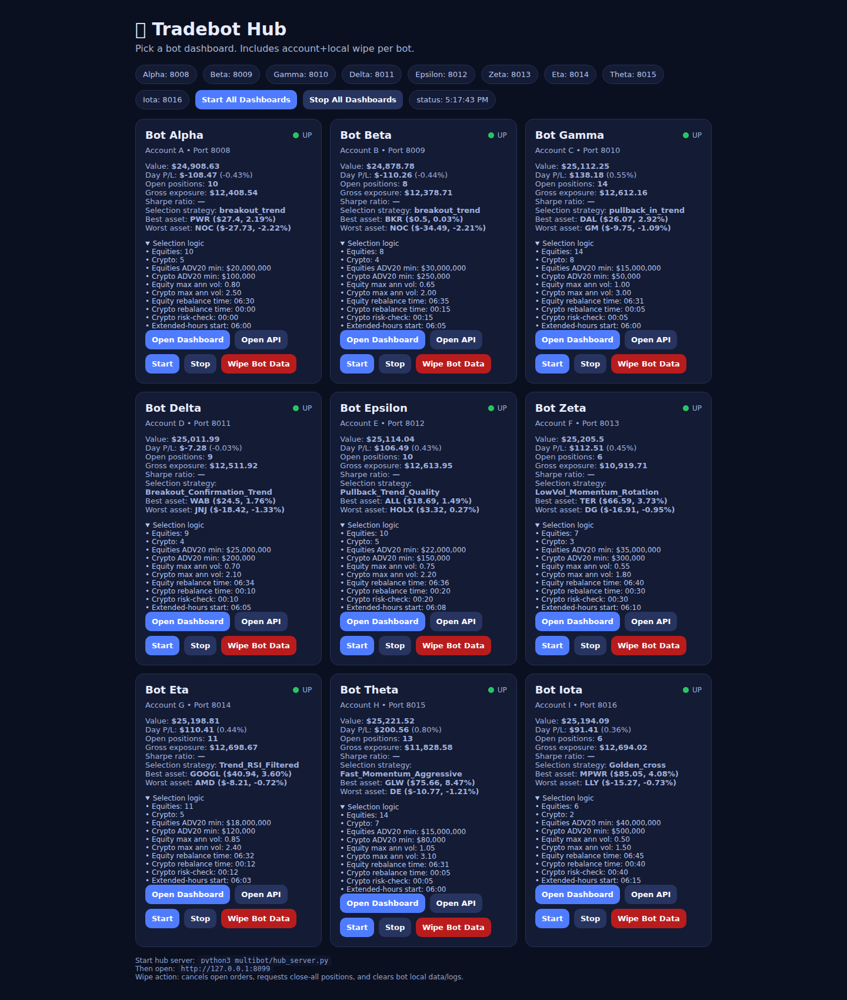

# Multi-Bot Hub (up to 9 bots)

This repo now includes a unified multi-bot harness under `multibot/`.

## Layout

- `multibot/hub_server.py` — local control/overview server
- `multibot/dashboard-hub.html` — hub UI
- `multibot/scripts/` — start/stop/status/wipe/sync scripts
- `multibot/bots/<bot>/` — per-bot runtime/config folders
- `multibot/templates/<bot>/` — clean templates for each bot profile

Bots and ports:
- alpha: 8008
- beta: 8009
- gamma: 8010
- delta: 8011
- epsilon: 8012
- zeta: 8013
- eta: 8014
- theta: 8015
- iota: 8016

## Per-bot setup

Each bot needs its own credentials file:

```bash
cp multibot/bots/alpha/.env.example multibot/bots/alpha/.env
# repeat for each bot, with different account credentials
```

## Run

```bash
python3 multibot/hub_server.py
```

Open: `http://127.0.0.1:8099`

Hub preview:



## Script controls

```bash
./multibot/scripts/start_dashboards.sh
./multibot/scripts/stop_dashboards.sh
./multibot/scripts/status.sh
./multibot/scripts/start_one.sh beta
./multibot/scripts/stop_one.sh beta
./multibot/scripts/wipe_bot.sh beta
./multibot/scripts/sync_shared.sh
```

## Notes

- `sync_shared.sh` mirrors shared strategy/preset files from repo root to all bot folders.
- `wipe_bot.sh` cancels open orders, requests close-all positions, and clears local bot data/logs.
- `.env` files and bot runtime data/logs are ignored by git.
